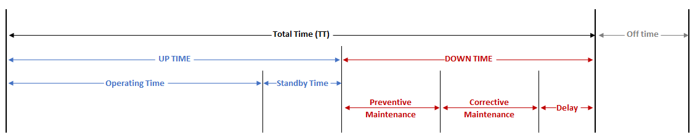
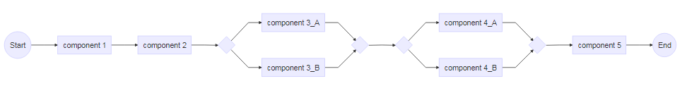
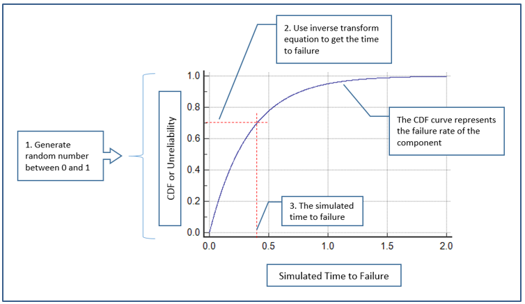
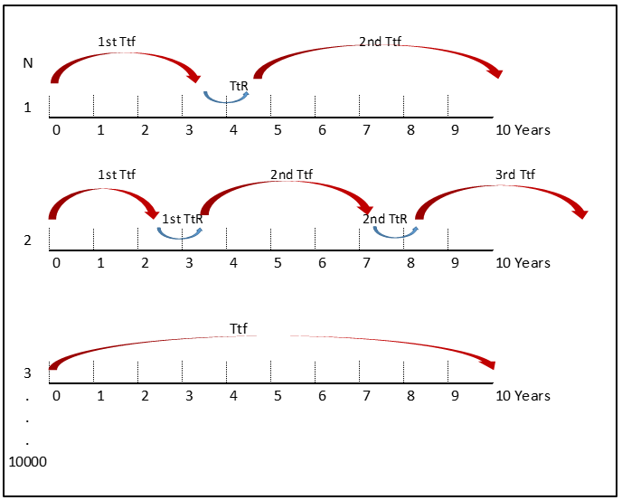

About RAM Study
===============

Reliability Availability and Maintainability (RAM) Study simulates the
arrangement, operation, failure, and maintenance of a system throughout
its mission duration. The study will provide statistical estimates of
several parameters of the system, such as its availability, expected
maintenance activities, and the overall reliability of the system. The
key definition is as follows:

1.  Reliability is defined as the ability of a system or component to
    perform its required functions under stated conditions for a
    specified period of time. It is expressed as a function of failure
    rate probability distribution and its mission duration. For a mature
    component or system, for a system reliability

2.  Availability is the parameter that translates system reliability and
    maintainability characteristics into an index of effectiveness. It
    is defined as a measure of the degree to which an item is in an
    operable and committable state at the start of a mission when the
    mission is called for at a random point in time. Others factor
    outside the turbine that affect the operability of the turbine, such
    as weather is outside the scope of the availability study and should
    be taken into consideration in the risk analysis. The basic
    relationship model for availability is :
    $$Availability = \\frac{Uptime}{Uptime + Downtime}$$
    Availability is time-related function, below figure illustrates the
    breakdown of total equipment time into its time-based elements.

Breakdown of total system time

 

<table>
<colgroup>
<col style="width: 50%" />
<col style="width: 50%" />
</colgroup>
<thead>
<tr class="header">
<th>Item</th>
<th>Definition</th>
</tr>
</thead>
<tbody>
<tr class="odd">
<td>TT</td>
<td>Total Time, total intended utilization period</td>
</tr>
<tr class="even">
<td>Operating Time</td>
<td>Operating Time (Equipment in use)</td>
</tr>
<tr class="odd">
<td>Standby Time</td>
<td>Standby Time (not operating but assumed operable) in a specified period</td>
</tr>
<tr class="even">
<td>Preventive Maintenance</td>
<td>Scheduled maintenance time per specified period</td>
</tr>
<tr class="odd">
<td>Preventive Maintenance</td>
<td>Corrective Maintenance, unscheduled maintenance per specified period</td>
</tr>
<tr class="even">
<td>Delay</td>
<td>Administrative and Logistics Downtime, down time spent waiting for parts, administrative processing, maintenance personnel, or transportation per specified period</td>
</tr>
<tr class="odd">
<td>Off time</td>
<td>During this time, system operation is not required, hence it is excluded from availability analysis</td>
</tr>
</tbody>
</table>

   

1.  Maintainability is defined as the ability of an item to be retained
    or restored to specified conditions when maintenance is performed by
    qualified personnel. For the purpose of the study the following
    maintenance assumptions is considered

Reliability Block Diagram (RBD)
-------------------------------

A Reliability Block Diagram (RBD) is a a method to represent system
configuration from reliability point of view. It represents the state of
the system, in this case the functioning states of its components. A
system can be modeled in series block configuration when all of the
components within that system have to successfully function during the
intended mission time of the system in order for the system to success,
as a consequence if there is any components in the system fail, it
results in the system failure as a whole. When there is redundancy of a
particular component in the system, it can be modeled as a paralel block
in RBD.

Example of Reliability Block Diagram

  For more complex system reliability configuration that cannot be
easily represented by a combination of series-parallel block diagram,
cut set or path set methods can be used to determine the reliability of
such system.  
 

Monte Carlo Simulation
----------------------

Monte Carlo Simulation (MCS) uses pseudo random numbers generator and
statistical models to simulate (imitate) reality. In the case of
availability simulation, this approach is similar to a virtual
experiment in which a random number is generated based on the failure
rate characteristic of the evaluated system in order to represent its
time to failure. The resulting time to failure from the simulation is
then evaluated against the required mission time, where their failure
occurrences and required reparation are recorded. The process is
repeated for large number of times, each one behaving differently due to
the stochastic characters of the component failure behavior. From the
accumulative output, the mean availability and other information can be
gathered. The accuracy of the simulation is depends on the accuracy of
the probability distribution of the component failure and the numbers of
repeated simulaton.

In MCS, the inverse transform method is one of the technique to generate
random numbers from any failure rate distribution type given its
cumulative distribution function (CDF). CDF is the unreliability
function of a component. Inverse transform method takes uniform samples
of a number *U* between 0 to 1, interpreted it as a CDF and then
inverting that function to have the time to failure of the component.
For component failure rate with exponential distribution type, the CDF
and its inverse transform method is expressed as:
*C**D**F* *o**r* *U**n**r**e**l**i**a**b**i**l**i**t**y* (*U*) = 1 − *e*( − *λ*.*T**t**F*)
where
$$TtF = -\\frac{1}{\\lambda}ln(1-U)$$

. Illustration of inverse transform method to generate simulated time to
failure for component with exponential distribution failure rate

 

The implementation of MCS in Reliability simulation utilizing
Reliability Block Diagram as the basis of the simulation is explained
below.

<table>
<colgroup>
<col style="width: 50%" />
<col style="width: 50%" />
</colgroup>
<thead>
<tr class="header">
<th>Arrangement</th>
<th>Definition</th>
</tr>
</thead>
<tbody>
<tr class="odd">
<td>Series Arrangement</td>
<td>In a series system, any fail components will results in system failure. During the MCS if the simulated time to failure of any of the component is below the mission duration, the system is considered to be failed</td>
</tr>
<tr class="even">
<td>Hot Redundancy</td>
<td>For hot redundancy, where both component operational, the redundant system will fail if the highest simulated time to failure of one of the components in the redundant arrangement is lower than the mission duration.</td>
</tr>
<tr class="odd">
<td>Cold Redundancy</td>
<td>For cold redundancy, where one component is on stand-by, the redundant system will fail if the summation of the time to failure of the components in the redundant system fall below the mission duration</td>
</tr>
</tbody>
</table>

The following figure illustrates the MCS procedure. For the first
simulation, the component fails after 3 years of operation (1st TtF),
then it undergoes a corrective maintenance.

  In this illustration the total mission duration is 10 years. After
the restart, a new random number is generated to simulate the time to
failure of the component. The process is repeated until the accumulated
time surpass the mission time which is 10 years. For the first
simulation the component total time (TT) surpass the mission duration
with one failure. On the second simulation, through similar random
number generation process, the component fails twice throughout its
mission duration, whereas the third simulation the component does not
fail at all. For each iterations, the following informations are
recorded: - System reliability and availability - Total number of
repairs - Which components causing the failure and their time to failure

This procedure is then repeated for *n* times. In the end, the tidal
turbine availability is estimated to be the mean availability value of
the *n* simulation. The other parameters are also averaged from the *n*
simulation.

 

------------------------------------------------------------------------

 

About this simulation
=====================

This simulation is developed in R programming language. It is hosted in
[shinyapps.io](https://www.shinyapps.io/). Due to limitation of this
account, several simulation parameters are constrained to certain
maximum values.

<table>
<colgroup>
<col style="width: 50%" />
<col style="width: 50%" />
</colgroup>
<thead>
<tr class="header">
<th>Items</th>
<th>Remarks</th>
</tr>
</thead>
<tbody>
<tr class="odd">
<td>components_input</td>
<td>Name of the system components to be included in the simulation. (Max = 10)</td>
</tr>
<tr class="even">
<td>failure_rate</td>
<td>Failure rate per year for each component. If there is any redundancy, the redundant component will have identical failure rate. (Min = 0.1, Max = 10)</td>
</tr>
<tr class="odd">
<td>time_to_repair</td>
<td>Time to repair the component in hours.</td>
</tr>
<tr class="even">
<td>redundancy</td>
<td>Redundancy options. There are three option, no redundancy, hot redundancy, and cold redundancy.</td>
</tr>
<tr class="odd">
<td>select</td>
<td>Option to include or exclude certain component in the simulation.</td>
</tr>
<tr class="even">
<td>Generate RBD Button</td>
<td>Once the components information table is filled, click the generate RBD button in order to generate the RBD. In the event where components information table is modified after a simulation, click the generate RBD button again prior to starting a new simulation.</td>
</tr>
<tr class="odd">
<td>Mission Time Duration</td>
<td>Duration of the system (in year) to which the time to failure of the system is evaluated against. (Max = 10 years)</td>
</tr>
<tr class="even">
<td>Simulations Number</td>
<td>Number of simulation iterations to be conducted (Max = 5000)</td>
</tr>
</tbody>
</table>
